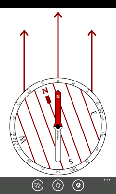
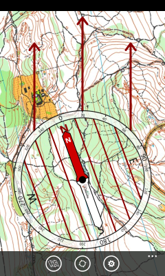
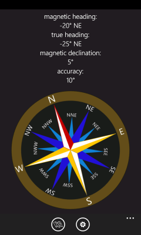
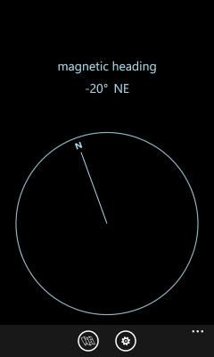
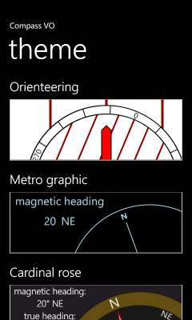

**Compass VO**

Compass application for windows phone (8, 8.1) and windows mobile 10 that features an ***adjustable background map*** from a photo or a selected picture.
The compass needle works properly only on devices that contains magnetometer sensor.

**Quick start**

For direct use on device just search 'Compass VO' in Microsoft Application Store and install the app.

For further customization and extra features development, get the sources, enhance it, then please share with us.

**Screenshots**

